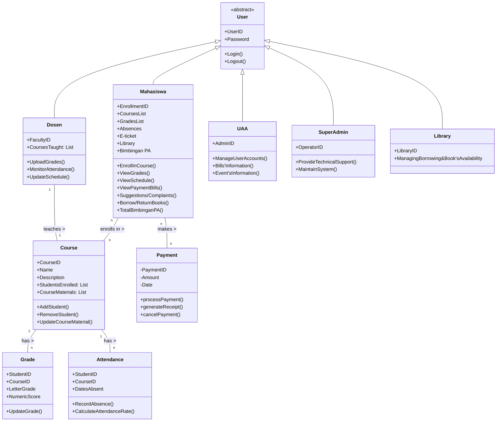

# UTS-OOP
Nama: Steven Salvador Paembonan Nim: 422023029

**Functionality**

Authentication: Sistem memiliki fitur login yang memverifikasi user ID dan password.

Capability: Sistem harus bisa digunakan oleh setiap role yang berbeda seperti mahasiswa (bisa melihat nilai, melihat pembelajaran), dosen (upload nilai, upload materi), admin (Menginformasikan tagihan), superadmin (Maintence sistem, update fitur)

Reusability: Komponen seperti autentikasi pengguna, pengambilan data, dan layanan notifikasi harus dirancang untuk digunakan kembali di berbagai modul.

Security: Otentikasi pengguna, enkripsi data, dan kontrol akses sangat penting. Nilai mahasiswa, tagihan, data seperti ini harus di kelola dengan aman.

**Usability**

Simplicity: Interface pengguna cukup sederhana dan langsung, misalnya fungsi login yang mudah digunakan.

Feedback: Setiap aksi seperti login yang berhasil atau gagal, peminjaman buku, atau pengunggahan nilai memberikan feedback langsung ke pengguna.

Accessibility: Kode menyediakan akses ke berbagai fungsi berdasarkan role pengguna yang terdefinisi.

Human Factors: tampilan user interface nya harus responsif untuk digunakan oleh semua device yang berbeda, mengakomodasi beragam  teknologi.

Consistency: sistem harus di maintain dengan baik dan harus konsisten agar semua user bisa menggunakan dengan baik.

Documentation: Panduan pengguna yang komprehensif untuk setiap peran pengguna, FAQ, dan manual sistem diperlukan.

*Reliability*

Availability: Sistem harus siap 24/7.

Failure Rate & Duration: harus memiliki tingkat gagal yang rendah dan harus diselesaikan dengan cepat.

Predictability: Perilaku sistem dalam menanggapi tindakan pengguna harus dapat diprediksi dan konsisten.

Error handling: Kode memiliki penanganan kesalahan dasar di login (pemberitahuan untuk ID pengguna atau kata sandi yang salah).

Data integrity: Data seperti user ID dan password disimpan secara privat (`_user_id` dan `_password`).

**Performance**

- Speed: Fast Response untuk pertanyaan dan tindakan pengguna.
- Efficiency: Optimized for minimal resource consumption without compromising functionality.
- Resource Consumption: Harus dioptimalkan agar berfungsi dengan lancar pada perangkat keras institusional standar.
- Scalability: Mampu menangani peningkatan jumlah data dan pengguna.

**Supportability**

- Testability: Sistem harus mudah untuk di uji untuk menemukan dan memperbaiki bug - bug yang masih ada.
- Extensibility: Sistem harus di design mudah  untuk melakukan  update, penambahan  fitur dengan mudah .
- Serviceability: Masalah dalam sistem harus mudah didiagnosis dan di fix.
- Configurability: pengizinan konfigurasi fitur yang mudah seperti peran pengguna, izin, dan pengaturan sistem.
- 

